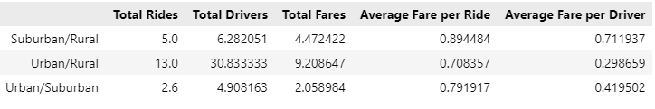
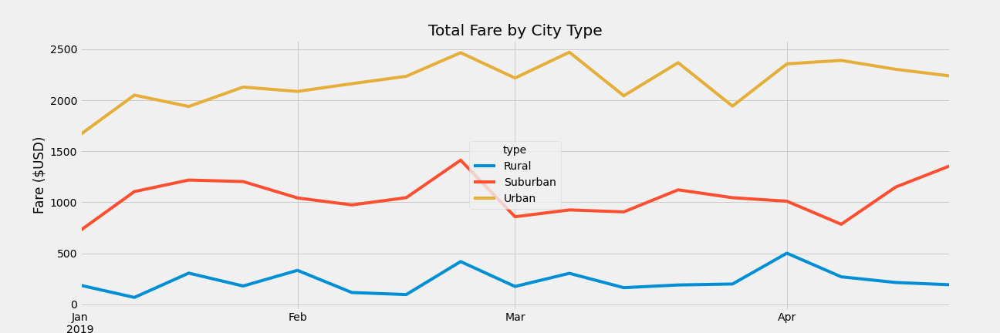

# PyBer_Analysis - Overview

### The goal of this analysis was to determine how ride-share data for the fictional PyBer company differs between cities classified as urban, suburban, and rural.

- The metrics used to compare cities included:
    - Total Rides
    - Total Drivers
    - Total Fares collected
    - Avearge fare per ride
    - Average fare per driver

- The time period covered by the data runs from Jan 1 2019 through May 8 2019 and includes 120 cities total, broken down as follows:

|Type|City Count|
|----|----|
|Rural|18|
|Suburban|36|
|Urban|66|

## Results
The table below details the key differences between city types.
Moving from rural to suburban to urban, we can see that the total number of rides taken, as well as the total number of available drivers and total fare collected, increases.
Following the same city type progession, we also see the average fare per ride and per driver decline.
It's note worthy that in urban areas, drivers averaged less than one ride over the time period (1625 rides/2405 drivers), while in suburban and  rural areas, the average was over 1 (625 rides/490 drivers and 125 rides/78 drivers respectively).

It's also instructive to review ratios of the above data, to get a sense of the scale of differences. In the table below we can see:
- for Urban/Rural: 30x drivers produce 10x fares
- for Urban/Suburban: 4.9x drivers produce 2x fares 

Finally, looking at fares by city type through time we can see revenue has trended upwards slightly, though urban and rural revenues pulled back towards the end of the analysis period, while suburban revenue saw an uptick.

## Recommendations

- Decrease urban drivers - this will drive revenue per driver up and should not aversely impact total revenue, given the lower efficiency (rides/driver) seen in urban areas.
- Another option here would be to increase urban fares; a better understanding of price sensitivity across all city types would be useful here.
- Add rural drivers - under the assumption these areas are underserved, adding drivers will increase total revene the quickest.
- Add suburban drivers - they produce 1/2 the total fare, with 1/5 the number of drivers and roughly 1/3 (1/2.6) the rides; also seen in average fare per ride and driver.